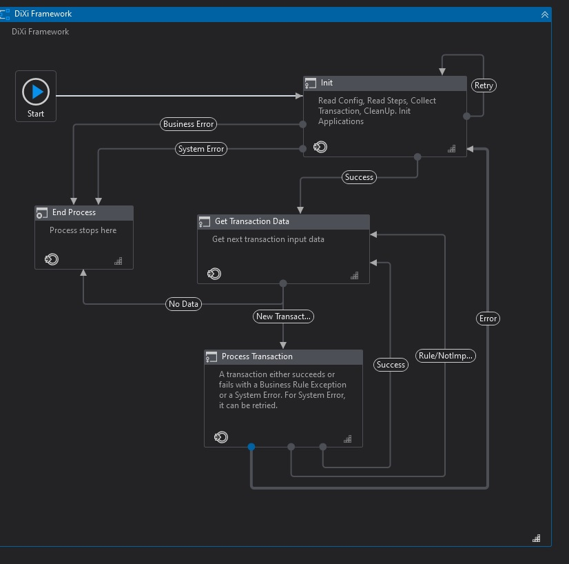

# DiXi Framework

# Version: 1.0.0

# Author: Mahmoud Shaheen

## Why?
Our main goal is to separate application logic from business logic.
CRef is built to overcome some limitations in REF and minimize changes made by developers in REF and also to add some crucial features.
The most critical feature is you can change Transaction type or even make it linear process by only changing config.

## Architecture:

## Features:
	* built on top of Transactional Business Process template
	* using State Machine layout for the phases of automation project
	* offering high level exception handling and application recovery
	* keeps external settings in Config files and Orchestrator assets
	* pulls credentials from Credential Manager and Orchestrator assets
	* gets queue transaction data from Orchestrator queue and updates back status
	* takes screenshots in case of application exceptions
	* provides extra utility workflows like sending a template emails

## New Features:
	* don't open apps when no transactions
		If the process is transactional and no transactions found the process will end without opening applications which increase efficiency and utilization
	* Init retry
		Init State is retried for maximum number of times (determined from Config) in case of system exceptions
	* Reporting
  		FW built with reporting in mind by and this is achieved by multiple ways
		Custom log field contains transaction ID added automatically to each transaction.
		Process Run Reporting (File/Mail) report file generated in each run and sent by Email to process admin then archived.
		Reporting Queue Each Transaction will be added to reporting queue with its state.
	* Add transactions to Queue
		Transactions can be collected before the process start if you decided that a separate dispatcher isn't needed
	* Mail Reusable
		Reusable component for sending Emails which handles common issues
		Mail Provider Abstraction, Currently supports Exchange & Outlook providers
	* Smart Config
		Distributed Process Config
		Assets & Credentials Support
		Assets & Credentials Overrides normal Configuration
	* Common Used Functions
		Snippets for common used functions
	* Custom Handlers:
		FW gives you a way to extend its functionality by providing a way to implement custom handlers for common states.
		* Success
		* Business Exception
		* System Exception
		* Not-Implemented Exception
		* Process End (Send Report)
		* Process Start (Clean Up)
		* Reporting
	* Generic Transaction item
		Process can be either Linear (such as reporting processes) or transactional (Such as Tickets processes)
		Transactions can be either Queue or data-table and it's up to the developer to choose.
		Thransaction type is set from config file (Constants)
		Process step files snippets are provided and you choose the file according to transaction type.
	* Process Steps
		Process can be exploded to steps so the FW logs all variables after each step, but if you wish to follow the old school way that the Process is in one file just make a one process step.
	* Retry Steps (ALPHA)
		This is a feature to retry the transaction from the step it failed in but it shouldn't be used now because the process variables is cleared before it retry.
	* Process timeout
		Timeout can be set for transaction to avoid 
	* init from CSV
		CSV is used instead of Excel for configuration because it's more effecient and can be opened by any text editor.
	* Process Dictionary
		A dictionary to save process variables between steps and it's cleared after each transaction.
	* Global Dictionary
		A dictionary to save process variables in the global space and not cleared for the whole run.
	* Screenshot as a feature
		In case of exceptions you can choose to take screenshot and include it in the Email for better debugging.
	* Time reporting
		Each transaction start, end time & duration are reported for each transaction.
	* Features Toggle
		All features can be toggled On/Off from config file (Features)
	* IsDev Environment Variable
		A way to differentiate between debug and production (Inspired by VS), this variable is set from config file and it will be added automatically to process environment variables, you can find a snippet how to check for it in the snippets folder. 
	* Audit Logs
		Many Logs are added for auditing and to know exactly where the process is doing at any time of execution.
	* Transaction Generic reference:
		Transaction ID added automatically to each transaction by using the field name from config, it's added to all reporting methods automatically.
	* Introduce new Exception Type (Not-Implemented Exception):
		Along with System & business exceptions a new exception is introduced for handling other exceptions which can't be considered system nor business.

## Development Steps:
	* Create Applications Components
	* Create Process steps for applications
	* Add process steps paths to steps file.
	* Set Configuration Files in "Data\Config"
	* •	Add process configuration to config files "Data\Config"
	* Add invoke applications opening sequence in InitAllApps
	* Add invoke applications Closing sequence in CloseAllApps
	* Add invoke applications kill sequence in KillAllProcesses
	* Collect Transactions if needed 
	* Clean-Up if needed

## Guidelines
	* Please DO NOT edit the FW files unless you know exactly what you are doing!
	* Please Follow UiPath Development best practices guide!
	* Don't forget to add Logs and annotations

## Reserve step at retry Issue
	* Process dictionary isn't kept during retry. And if it's kept problem will occur for queue items, as not the same item will be worked on immediately if failed
	* So it shouldn't be used now, disable it from features file!

## [Development Guidelines](./Documentation/UiPathBestPractices.pdf)

## [REFramework Documentation](./Documentation/REFrameworkDocumentation.pdf)
